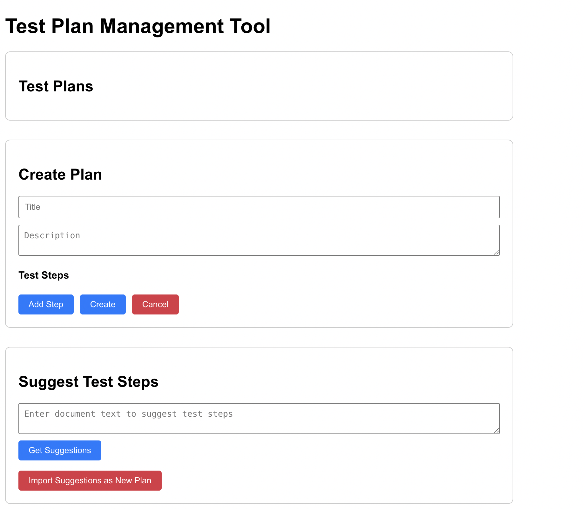
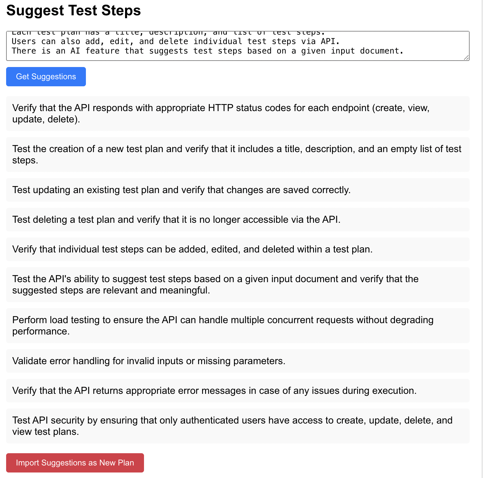

# Test Plan Management Tool

## Overview
This is a minimal AI-based test plan management tool. 

## Architecture & Technical Choices

### Backend (FastAPI - Python)
- **Framework**: FastAPI for REST API development with automatic OpenAPI documentation
- **Database**: SQLite with SQLAlchemy ORM (lightweight, file-based)
- **AI Integration**: Local Ollama service with Mistral 7B model
- **Validation**: Pydantic models for request/response validation
- **CORS**: Enabled for frontend-backend communication

### Frontend (React)
- **Framework**: Create React App with hooks-based state management
- **HTTP Client**: Axios for API communication
- **Styling**: Basic CSS with minimal responsive design
- **Loading States**: Real-time feedback during AI generation

### Why These Choices?
- **FastAPI**: Modern, async-ready, automatic documentation, strong typing
- **SQLite**: Zero configuration, suitable for development/demos
- **React**: Industry standard, component-based, efficient for this scale
- **Local Mixtral**: Privacy-focused, no API costs, works offline, 7B works well for relatively complex tasks like summarizing a long description into test steps

## 🚀 Getting Started

### Prerequisites
- Python 3.13+
- Node.js & npm
- Ollama installed and running
- Mistral model installed (`ollama pull mistral`)

### Installation & Setup

#### Backend Setup
```bash
# Navigate to backend directory
cd backend

# Create Python virtual environment
python -m venv venv

# Activate virtual environment
source venv/bin/activate  # (Linux/Mac)
# or venv\Scripts\activate  # (Windows)

# Install dependencies
pip install -r requirements.txt
```

#### Frontend Setup
```bash
# Navigate to frontend directory
cd frontend

# Install Node.js dependencies
npm install
```

### Running the Application

#### Step 1: Start Ollama AI Service
```bash
ollama serve
```
If you navigate to `http://localhost:11434/` and it says `Ollama`, you're good to go. 
*Note: Ollama must be running for AI suggestions to work*

#### Step 2: Start Backend Server (Terminal 1)
```bash
cd backend
source venv/bin/activate  # Activate virtual environment
uvicorn backend.main:app --reload
```
API Documentation: `http://localhost:8000/docs`

#### Step 3: Start Frontend Application (Terminal 2)
```bash
cd frontend
npm start
```
Frontend will be available at: `http://localhost:3000`

## 📖 Usage Guide

### Core Features

#### 1. View Test Plans
- All test plans are listed on the main page
- Each plan shows title, description, and associated test steps
- Edit/Delete buttons for each plan

#### 2. Create New Test Plan
- Click "Create Plan" section
- Fill in title and description
- Add test steps by clicking "Add Step"
- Click "Create" to save

#### 3. Edit Existing Plan
- Click "Edit" button on any existing plan
- Modify title, description, or test steps
- Click "Save" to update

#### 4. AI-Based Test Suggestions
- Enter document text (requirements, specifications, etc.)
- Click "Get Suggestions"
- AI generates title, description, and test steps
- Click "Import Suggestions as New Plan" to create plan from AI output
- Click "Create" to save to list of test plans

### Example Document Input
```
Feature: Test Plan API

The backend exposes RESTful endpoints for creating, viewing, updating, and deleting test plans. 
Each test plan has a title, description, and list of test steps. 
Users can also add, edit, and delete individual test steps via API. 
There is an AI feature that suggests test steps based on a given input document.
```

### Expected AI Output
**Title**: API Test Plan for RESTful Endpoints
**Description**: This test plan verifies the functionality and integrity of the API endpoints for creating, viewing, updating, and deleting test plans, managing test steps, and utilizing AI-suggested test steps.
**Steps**:
1. Verify that the API is accessible and returns a status code 200 for the base URL.
2. Create a new test plan with a unique title and description using the appropriate endpoint and verify the response contains the created test plan data.
3. Retrieve an existing test plan by ID, ensure the returned data matches the stored test plan details.
4. Update an existing test plan's title and description using the API and confirm that the updated information is correctly saved and retrievable.
5. Delete a test plan using the API and verify it can no longer be retrieved or updated.
6. Add, edit, and delete individual test steps for a given test plan using the corresponding API endpoints and confirm changes are saved correctly.
7. Test AI-suggested test steps by providing an input document to the AI feature and verifying that the returned test steps are relevant and can be added to an existing test plan.
8. Perform negative tests, such as attempting to create a test plan with invalid data or deleting non-existent test plans, to ensure proper error handling is in place.
9. Monitor API response times and error rates during load testing to assess performance under various scenarios.
10. Validate the security of the API by testing for unauthorized access attempts and ensuring that only authorized users can create, update, delete or view test plans and their respective steps.

## Technical Implementation Details

### Database Schema
```python
# backend/models.py
TestPlan:
  - id: Primary Key (Integer)
  - title: Indexed String
  - description: String

TestStep:
  - id: Primary Key (Integer)
  - description: String
  - plan_id: Foreign Key → TestPlan.id
```

### API Endpoints
| Method | Endpoint | Description |
|--------|----------|-------------|
| GET | `/plans` | List all test plans |
| POST | `/plans` | Create new test plan |
| GET | `/plans/{id}` | Get specific test plan |
| PUT | `/plans/{id}` | Update test plan |
| DELETE | `/plans/{id}` | Delete test plan |
| POST | `/suggest` | Generate AI test plan from document |

### AI Integration
- **Model**: Mistral 7B (local via Ollama)
- **Task**: Structured test plan generation
- **Input**: Free-form document text
- **Output**: Title, description, and numbered test steps

## 🤖 AI Assistance Used

### Development Tools & Libraries
- **VSCode**: Used for running project
- **Cline (free x-ai/grok-code-fast-1)**: Used for planning structure of project, generating most of the frontend, and generating most of the code for database models
- **ChatGPT-4**: Used for helping with generating the REST API parts of the backend 

### Specific AI-Assisted Features
1. Database Relationship Setup
2. React State Management
3. Error Handling Patterns
4. CORS Configuration
5. API Request Formatting 

## Testing

### Manual Testing Performed
- Test plan CRUD operations
- AI suggestion generation with different document types
- Frontend-backend communication
- Error handling

### Performance Notes
- **AI Generation**: 5+ seconds 
- **API Response**: <100ms for standard CRUD operations

## 📁 Project Structure
```
test-plan-management-tool/
├── backend/
│   ├── __init__.py          # Python package marker
│   ├── main.py             # FastAPI application & routes
│   ├── models.py           # SQLAlchemy database models
│   └── requirements.txt    # Python dependencies
├── frontend/
│   ├── public/
│   │   ├── index.html      # React HTML template
│   │   └── manifest.json   # PWA manifest
│   └── src/
│       ├── App.js          # Main React component
│       ├── App.css         # Component styles
│       ├── index.js        # React entry point
│       └── index.css       # Global styles
└── README.md               # This documentation
```

## Examples








